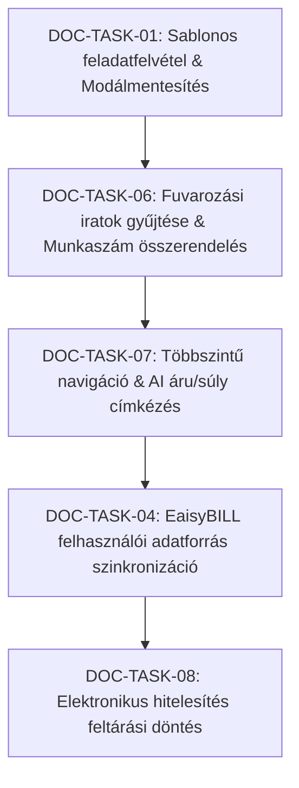

# eaisyDOCS – Továbbfejlesztési Feladatlista és Munkaterv (v1.2)

> **Fókusz:** Kizárólag az elektronikus irat- és dokumentumkezelő (**eaisyDOCS**) modul feladatai, folyamatai és ERP integrációi.  
> **Forrásdokumentum:** `EaisyDOCS és EaisyHR továbbfejlesztés v 1.2.md` és `eaisyDocs_szoftverterv.md`  
> **Létrehozva:** 2026. október 10.  
> **Állapot:** Tervezet / Végrehajtásra kész  
> **Szakmai & Jogszabályi háttér:** 335/2005. (XII. 29.) Korm. rendelet (közfeladatot ellátó szervek iratkezelési etalonja), 2015. évi CCXXII. törvény (E-ügyintézési tv.), GDPR, ISO 19005-2 (PDF/A archiválás), eIDAS

---

## 📊 eaisyDOCS Feladat Mátrix és Áttekintő

| Azonosító | Terület / Funkció | Feladat megnevezése | Eredeti Kód | Prioritás | Becsült Ráfordítás | Státusz |
|---|---|---|---|---|---|---|
| **DOC-TASK-01** | `Iratmunkafolyamat & Feladatok` | Feladatkatalógus és a feladatfelvétel beágyazott sablonos átalakítása | DOC-01 | 🔴 Magas | Közepes (2-3 óra) | ✅ **Kész (A-045, P-064)** |
| **DOC-TASK-02** | `Szignálás & AI Munkafolyamat` | Automatikus szignálás határainak rögzítése (AI szervezeti szinten, személy manuális) | DOC-02 | 🟡 Közepes | Kisebb (1 óra) | ✅ **Kész (Elfogadva)** |
| **DOC-TASK-03** | `Adminisztráció & UI Struktúra` | Személyes profil (`/profile`) és rendszerszintű beállítások (`/settings`) szétválasztása | DOC-03 | 🟡 Közepes | Közepes (2 óra) | ✅ **Kész (Elkészült)** |
| **DOC-TASK-04** | `Integráció & Felhasználókezelés` | Egységes felhasználókezelés és külső EaisyBILL felhasználói adatforrás | DOC-04 | 🟡 Közepes | Közepes (2-3 óra) | ⏳ **Tervezett** |
| **DOC-TASK-05** | `Alaprendszer & Multi-Tenancy` | Több-bérlős működés (Multi-Tenancy) és adatbázis-szintű cégizoláció | DOC-05 | 🔴 Magas | Nagy (3-4 óra) | ✅ **Kész (A-034, A-044, P-053, P-063)** |
| **DOC-TASK-06** | `Speditőri Folyamatok & ERP` | Fuvarozási iratok automatikus gyűjtése és ERP projekt/munkaszám összerendelés | DOC-06 | 🔴 Magas | Nagy (4-6 óra) | ⏳ **Tervezett** |
| **DOC-TASK-07** | `Keresés & Dokumentum Intelligencia` | Többszintű navigáció és AI-alapú fuvarozási címkézés (árufajta, súly, célhely) | DOC-07 | 🟡 Közepes | Közepes (3-4 óra) | ⏳ **Tervezett** |
| **DOC-TASK-08** | `Hitelesítés & Biztonság` | Elektronikus hitelesítés és távoli aláírás piaci lehetőségeinek feltárása | DOC-08 | ⏸️ Alacsony | Kisebb (2 óra kutatás) | ⏸️ **Elhalasztva (Feltárás)** |

---

## 📋 Részletes Feladatleírások (Specifikáció)

### DOC-TASK-01: Feladatkatalógus és a feladatfelvétel beágyazott sablonos átalakítása ✅
- **Eredeti hivatkozás:** DOC-01
- **Üzleti cél:** Az iratkezelési folyamatban a feladatkiosztás korábban többszörösen egymásba nyíló felugró ablakokban (modál a modálban) történt, ami zavaró volt és megszakította a munkát. Ehelyett a fő felületen beágyazott sablonkatalógusból induló feladatfelvételre van szükség, a meglévő állapotgép megőrzésével.
- **Megvalósított működés:**
  1. **Beágyazott feladatfelvétel (0 Popup):** A feladatkészítő kártya (`TasksTab`) közvetlenül a feladatlista tetején kapott helyet, gyors sablonválasztó szalaggal (`Jóváhagyás`, `Könyvelés`, `Jogi felülvizsgálat`, `Válaszlevél készítése`, stb.) és lenyitható sablonkatalógussal.
  2. **Kétoszlopos tágas munkatér:** Bal oldalon (65%) a feladatok és a beágyazott készítő, jobb oldalon (35%) a dedikált belső megjegyzések és üzenőfal.
  3. **Dedikált Válaszlevelek & Expediálás fül:** A válaszlevelek kezelése új dedikált lapra (`OutgoingDocumentsTab`) került háromlépcsős interaktív varázslóval (Címzett és csatorna, Szövegezés: Saját / Gemini AI / Sablonok, Véglegesítés és kiküldés).
  4. **Állapotgép megőrzése:** A szabványos életciklus megmarad: **nyitott → folyamatban → teljesítve → lezárva**.
- **Érintett komponensek:**
  - `src/components/tasks-tab.tsx`
  - `src/components/outgoing-documents-tab.tsx`
  - `src/app/dossiers/[id]/ai-reply-actions.ts`
  - `src/app/dossiers/[id]/page.tsx`
- **Elfogadási feltétel (DoD):** ✅ **Teljesítve (A-045, P-064)**. Sablonból indítható feladatfelvétel a feladatok felületén beágyazva, egymásba ágyazott felugró ablakok nélkül, dedikált kimenő válaszlevél varázslóval.
- **Státusz:** ✅ **Kész (A-045, P-064)**.

---

### DOC-TASK-02: Automatikus szignálás határainak rögzítése és AI támogatás ✅
- **Eredeti hivatkozás:** DOC-02
- **Üzleti cél:** A beérkező iratok feldolgozásakor tisztázni kellett az automatizáció határait. A megbeszélésen elfogadott döntés szerint az AI az érkeztetett iratot a tartalma alapján automatikusan a megfelelő **szervezeti egységhez** szignálja (pl. Pénzügy, Üzemeltetés, HR), míg a konkrét ügyintéző munkatárshoz rendelés **manuális** vezetői/iktatói döntés marad.
- **Megvalósított működési elv:**
  1. Az ügyintéző elindítja az iktatást a bejövő sorból.
  2. Az OCR és AI kivonatolás felismeri az irat típusát és tárgyát, és ajánlást tesz a felelős szervezeti egységre (`szervezeti_egyseg_id`).
  3. A szervezeti egység vezetője vagy kijelölt iratkezelője a saját felületén kézzel rendeli a konkrét munkatárshoz az ügyet (`felelos_user_id`), mivel az irat beérkezésekor még nem ismert az aktuális belső munkaterhelés.
- **Érintett komponensek:**
  - `src/app/incoming/page.tsx`
  - `src/app/incoming/actions.ts`
  - `src/components/auto-fill-modal.tsx`
- **Elfogadási feltétel (DoD):** ✅ **Teljesítve**. Tiszta folyamati elhatárolás: az AI nem írja felül közvetlenül a személyes felelősséget, hanem a szervezeti egységet célozza meg.
- **Státusz:** ✅ **Kész (Elfogadott működési modell)**.

---

### DOC-TASK-03: Személyes és rendszerszintű beállítások szétválasztása ✅
- **Eredeti hivatkozás:** DOC-03
- **Üzleti cél:** A beállítások menüpont korábban túl zsúfolt volt, a személyes profil és a rendszerszintű konfiguráció összemosódott. A feladat a saját adatok (`/profile`) és a rendszerszintű adminisztráció (`/settings`) szétválasztása volt.
- **Megvalósított struktúra:**
  1. **Személyes profil (`/profile`):**
     - Saját név, e-mail cím, avatar.
     - Jelszómódosítás és biztonsági beállítások.
     - Értesítési preferenciák (e-mail / belső figyelmeztetés).
  2. **Adminisztrációs központ (`/settings`):**
     - *Szervezeti egységek:* Osztályok, részlegek hierarchikus kezelése.
     - *Csapat és jogosultságok:* Felhasználók hozzárendelése szerepkörökhöz és biztonsági szintekhez (`nyilt`, `belso`, `bizalmas`, `szigoruan_bizalmas`).
     - *Irattári terv & Megőrzési idők:* Irattári tételek, selejtezhetőségi kódok, határidők.
     - *Rendszerkonfiguráció:* Iktatószám maszkok, cégadatok.
- **Érintett útvonalak:**
  - `src/app/profile/page.tsx`
  - `src/app/settings/page.tsx`
  - `src/app/settings/layout.tsx`
- **Elfogadási feltétel (DoD):** ✅ **Teljesítve**. A normál felhasználó csak a saját profilját szerkesztheti, a rendszergazda és HR-vezető pedig dedikált, áttekinthető menüpontból irányítja a szervezetet.
- **Státusz:** ✅ **Kész**.

---

### DOC-TASK-04: Egységes felhasználókezelés és EaisyBILL-adatforrás integráció ⏳
- **Eredeti hivatkozás:** DOC-04
- **Üzleti cél:** Az ERP ökoszisztémában (EaisyBILL, EaisyWORK, EaisyDOCS, EaisyHR) a felhasználói törzset ne kelljen minden modulban manuálisan újra felvenni. Legyen lehetőség a már létező EaisyBILL felhasználói névsort adatforrásként megjelölni és szinkronizálni.
- **Megvalósítási terv:**
  1. **Adatforrás választó kapcsoló a Beállításokban:**
     - `Felhasználói adatforrás: Helyi (EaisyDOCS)` vs. `Felhasználói adatforrás: EaisyBILL`.
  2. **Felhasználó-átvételi és szinkronizációs varázsló:**
     - A meglévő EaisyBILL felhasználói névsor lekérdezése (REST API vagy adatbázis összeköttetés).
     - Kiválasztási lehetőség: nem kötelező mindenkit átvenni (pl. külső könyvelőt nem szükséges behozni az iratkezelőbe).
  3. **Független moduljogosultságok:**
     - A közös identitás (e-mail, név) átvétele után a modulspecifikus jogosultságokat (`docs_szerepkor`, `biztonsagi_szint`, `szervezeti_egyseg`) a helyi adminisztrátor határozza meg.
  4. **Helyi felhasználókezelés megőrzése:**
     - Azon dolgozók számára, akik még nincsenek benne a számlázóban (pl. fizikai dolgozók, raktárosok), továbbra is elérhető a közvetlen helyi rögzítés.
- **Érintett fájlok & kutatás:**
  - Architektúra & Integrációs Terv: `docs/integrations/eaisybill-user-sync-research-and-architecture.md`
  - `src/app/settings/users/page.tsx`
  - `src/app/settings/integrations/page.tsx`
  - `src/utils/integrations/eaisybill-sync.ts`
  - Adatbázis: `felhasznalo_profil.external_id`, `felhasznalo_profil.sync_source`
- **Elfogadási feltétel (DoD):** Az adminisztrátor egy gombnyomással importálhatja és frissítheti a kiválasztott felhasználókat az EaisyBILL-ből anélkül, hogy elvesznének a már beállított helyi jogosultságok.
- **Státusz:** 📝 **Kutatás és Architektúra Terv Kész** (Implementáció a visibill / eaisybill csapattal egyeztetve indítható).

---

### DOC-TASK-05: Több-bérlős működés (Multi-Tenancy) és adatbázis-szintű cégizoláció ✅
- **Eredeti hivatkozás:** DOC-05
- **Üzleti cél:** Cégcsoportos vagy könyvelőirodai használat során több független gazdasági társaság (tenant) iratanyagát és adatait kell kezelni egyetlen rendszerpéldányon belül úgy, hogy az adatok véletlenül se keveredhessenek.
- **Megvalósított architektúra:**
  1. **Központi cégmodell:** `companies` tábla a bérlőknek, és `company_members` a felhasználói tagságoknak és cégspecifikus szerepköröknek.
  2. **Fejlécbeli cégválasztó:** A bejelentkezett felhasználó egyetlen kattintással válthat a társaságok között, azonnali munkamenet-frissítéssel (`set-active-company`).
  3. **Szigorú Postgres Row Level Security (RLS):**
     - Minden tábla (`irat`, `ugyirat`, `ugy`, `irattari_terv`, `partner`, `hr_dolgozo_adatlap`) `company_id` oszlopot kapott.
     - RLS policy: a felhasználó kizárólag azon rekordokat láthatja és módosíthatja, amely cégnek aktív tagja.
  4. **Moduláris függetlenség:** Az EaisyDOCS és EaisyHR teljesen szeparált jogosultságokkal, de közös cégazonosítóval működik.
- **Érintett fájlok & döntések:**
  - ADR: [A-034](docs/architecture/decisions/A-034-multi-company-architecture.md), [A-044](docs/architecture/decisions/A-044-hr-multitenancy-gdpr-isolation-architecture.md)
  - PRD: [P-053](docs/product/decisions/P-053-multi-company-management-ux.md), [P-063](docs/product/decisions/P-063-hr-multitenancy-gdpr-isolation-ux.md)
  - `src/components/company-switcher.tsx`
  - `src/utils/company-server.ts`
- **Elfogadási feltétel (DoD):** ✅ **Teljesítve**. Az 'A' cég felhasználója semmilyen felületen és API hívással nem láthatja a 'B' cég iratait és adatait.
- **Státusz:** ✅ **Kész**.

---

### DOC-TASK-06: Fuvarozási iratok automatikus gyűjtése és ERP projekt/munkaszám összerendelés ⏳
- **Eredeti hivatkozás:** DOC-06
- **Üzleti cél:** Speditőrcégek és fuvarozó partnerek számára az egyik legnagyobb adminisztrációs teher az egy-egy szállítási megbízáshoz tartozó irattömeg (CMR, nemzetközi fuvarlevél, fuvarmegbízás, kísérőlevelek, mérlegjegyek, vámpapírok) kézi gyűjtögetése. A cél egy automatikus összerendelési mechanizmus munkaszám/projektszám alapján.
- **Megvalósítási terv:**
  1. **Dokumentumátvétel ERP/CRM projektfolyamatból:**
     - Amikor az EaisyWORK / EaisyBILL modulban létrejön egy szállítási megrendelés, megkapja a saját munkaszámát (pl. `MSZ-2026/0842`).
     - Az EaisyDOCS-ban automatikusan létrejön a kapcsolódó ügyirat és gyűjtőcímke.
  2. **E-mailből érkező dokumentumok automatikus feldolgozása:**
     - Az EaisyBILL e-mail feldolgozó motorján keresztül beérkező csatolmányok (PDF, szkennelt képek) átadása az iratkezelőnek.
     - OCR szövegfelismerés: a munkaszám (vagy kapcsolódó megrendelésszám / rendszám) automatikus felismerése a dokumentum fejlécében vagy törzsében.
  3. **Automatikus összerendelés és dossziéba helyezés:**
     - Ha a munkaszám egyértelműen beazonosítható, az irat emberi beavatkozás nélkül az adott szállítási ügyiratba kerül, megkapva a megfelelő kategóriát.
     - Többértelműség vagy hiányzó munkaszám esetén: bekerül a "Feldolgozásra váró fuvariratok" ellenőrző sorába, ahol 1 kattintással hozzárendelhető a javasolt ügyhöz.
  4. **Teljes szállítási dosszié egy nézetben:**
     - A speditőr ügyintéző az EaisyDOCS-ban a munkaszámra keresve azonnal látja a fuvar összes iratát (megbízás + CMR + számla), anélkül hogy különböző mappákból kellene összevadásznia őket.
- **Érintett fájlok (tervezett):**
  - `src/app/freight/page.tsx` (Speditőri gyűjtőnézet)
  - `src/utils/freight/freight-matcher.ts` (Munkaszám és rendszám párosító motor)
  - `src/app/api/integrations/freight-documents/route.ts`
  - Adatbázis: `irat_kapcsolat` (`entitas_tipus = 'projekt'`, `entitas_id = munkaszam`)
- **Elfogadási feltétel (DoD):** A rendszer egy beérkező CMR dokumentumot a benne szereplő munkaszám alapján automatikusan a megfelelő fuvarügyirathoz iktat, és egyben megjeleníti a kapcsolódó megbízással.
- **Státusz:** ⏳ **Tervezett (Végrehajtásra vár)**.

---

### DOC-TASK-07: Többszintű navigáció és AI-alapú fuvarozási címkézés ⏳
- **Eredeti hivatkozás:** DOC-07
- **Üzleti cél:** A dokumentumokat ne csak iktatószám vagy partner alapján lehessen megtalálni, hanem üzleti tartalmuk (szállított áru jellege, feladási és célhely, tömeg/méret) szerint is, segítve a későbbi visszakeresést és a hasonló korábbi fuvarok árbecslését.
- **Megvalósítási terv:**
  1. **Klasszikus üzleti navigációs fa:**
     - Hierarchikus böngészési nézet: **Év → Partner / Megrendelő → Munkaszám / Projekt → Dokumentumok**.
  2. **AI-alapú műszaki és fuvarozási címkézés (Érkeztetéskor):**
     - *Dokumentumtípus:* CMR, Fuvarlevél, Mérlegjegy, Szállítólevél, Raklapjegyzék.
     - *Szállított árufajta:* pl. acélcső, acélszerkezet, hűtött élelmiszer, veszélyes áru (ADR).
     - *Viszonylat / Célhely:* Honnan – hová (pl. indulás: Budapest, érkezés: Berlin).
     - *Tömeg és jellemzők:* Rakomány tömege tonnában, terjedelmes rakomány jelölése (>5 tonna küszöbszűrés).
  3. **Összetett kereső és szűrőfelület (`TableToolbar` bővítés):**
     - Paraméteres szűrés: pl. *"Minden olyan szállítási irat, ahol az úti cél Berlin, az áru acélszerkezet, és a tömeg meghaladja az 5 tonnát"*.
  4. **Árbecslési adatbázis előkészítése:**
     - A strukturált adatok biztosítják az alapot arra, hogy új ajánlatadáskor az értékesítő azonnal visszakereshesse a korábbi hasonló fuvarok dokumentumait és fuvardíjait.
- **Érintett fájlok (tervezett):**
  - `src/components/freight/freight-tag-extractor.ts`
  - `src/components/freight/hierarchical-dossier-browser.tsx`
  - Adatbázis: `irat.freight_metadata` (jsonb: `{ cargo_type, origin, destination, weight_tons }`), FTS tsvector bővítés.
- **Elfogadási feltétel (DoD):** A felhasználó a fájlok egyenkénti megnyitása nélkül másodpercek alatt kilistázhatja a megadott árufajtájú és relációjú korábbi fuvarok dokumentumait.
- **Státusz:** ⏳ **Tervezett (Végrehajtásra vár)**.

---

### DOC-TASK-08: Elektronikus hitelesítés és távoli aláírás piaci lehetőségeinek feltárása ⏸️
- **Eredeti hivatkozás:** DOC-08
- **Üzleti cél:** Annak vizsgálata, hogy az EaisyDOCS rendszerből közvetlenül hogyan biztosítható a dokumentumok elektronikus hitelesítése (időbélyegzés, változatlanság igazolása) és a távoli kétoldalú elektronikus aláírás.
- **Vizsgálati szempontok (Feltárási scope – max. 2 óra):**
  1. **Dokumentum elektronikus hitelesítése:** Időbélyegzett PDF pecsét, amely igazolja, hogy a fájl a kiadás óta változatlan maradt (nem szerkesztésvédelem, hanem integritási bizonyíték).
  2. **Távoli két- vagy többoldalú aláírás:** Külső felek (partnerek, alvállalkozók) távoli hiteles aláírása (pl. szerződések, jegyzőkönyvek).
  3. **Szolgáltatói modellek összehasonlítása:**
     - White-label integráció (pl. Microsec e-Szignó API, Evrotrust).
     - Előfizetéses nemzetközi platformok (DocuSign API, Adobe Sign).
     - Állami szolgáltatások (AVDH / e-Papír / DÁP mobilalkalmazás integrálhatósága).
  4. **Költség- és díjazási struktúra:** Fix előfizetési díj vs. tranzakciónkénti (dokumentumonkénti) aláírási díj.
- **Vezetői döntés:** Balázs és Zoli korábbi egyeztetése alapján az éles fejlesztés jelenleg nem indokolt, a feladat kizárólag a piaci és technológiai lehetőségek 2 órás döntéselőkészítő összefoglalójára terjed ki.
- **Elfogadási feltétel (DoD):** 2 oldalas döntési összefoglaló a költségekről, API képességekről és jogi megfelelésekről.
- **Státusz:** ⏸️ **Elhalasztva / Feltárásra vár**.

---

## 🗺️ eaisyDOCS Fejlesztési Roadmap (Sprintterv a nyitott feladatokhoz)

Az eaisyHR modul elkészülte után az eaisyDOCS hátralévő feladatait az alábbi logikai és üzleti prioritási sorrendben javasolt végrehajtani:

### 0. Fázis: Iratmunkafolyamat és UI Rendezés (Sprint 0)
- **Fókusz:** **DOC-TASK-01** (Beágyazott sablonos feladatfelvétel, a felugró modálok megszüntetése az ügyirat/feladatok felületén).
- **Eredmény:** Letisztult, gyors in-place feladatkiosztás zavaró egymásba nyíló ablakok nélkül.

### 1. Fázis: Fuvarozási és Speditőri Automatizáció (Sprint 1)
- **Fókusz:** **DOC-TASK-06** (Munkaszám/projektszám alapú összerendelés, e-mail csatolmány feldolgozás, gyűjtőmappák).
- **Eredmény:** A speditőröknek megszűnik a kézi iratrendezés, minden CMR és megbízás azonnal a helyére kerül.

### 2. Fázis: Intelligens Keresés és Adatbányászat (Sprint 2)
- **Fókusz:** **DOC-TASK-07** (Év → Partner → Munkaszám böngészőfa, AI kinyert metaadatok: árufajta, célállomás, súly, árbecslési alapok).
- **Eredmény:** Villámgyors parametrikus keresés a fuvardokumentumok között.

### 3. Fázis: ERP Felhasználói Szinkronizáció (Sprint 3)
- **Fókusz:** **DOC-TASK-04** (EaisyBILL felhasználó-import, moduljogosultsági szétválasztás).
- **Eredmény:** Közös identitás az ökoszisztémában, zéró redundáns felhasználó-karbantartás.

---

## 🏛️ eaisyDOCS Architektúrális és Szabályozási Garanciák

Az eaisyDOCS fejlesztése során az alábbi alapelvek szigorúan érvényesek minden feladatra:

1. **Gap-mentes iktatószámok:** Nincs sorszámkihagyás vagy újrahasznosítás (`SELECT ... FOR UPDATE` allokációs tábla).
2. **Kizárólag Append-Only eseménynapló (`esemeny_naplo`):** Adatbázis szinten megvont UPDATE és DELETE jogok, minden megtekintés és letöltés naplózott.
3. **Fájlintegritás:** Minden feltöltött irat SHA-256 lenyomatot kap, az eredeti fájl mellett PDF/A-2b normalizált változat készül az archiváláshoz.
4. **Biztonságos fájlhozzáférés:** Nincsenek publikus URL-ek a Supabase Storage-ban; a dokumentumok kizárólag rövid élettartamú (60s) aláírt hivatkozásokkal érhetők el a jogosultságok ellenőrzése és naplózása után.
5. **Linear Flat UI Konzisztencia:** Minden új táblázatnál a központi `TableToolbar` (azonnali kereső + szűrő popover + oszlopválasztó), a statisztikáknál pedig a kanonikus `KpiCard` használandó (árnyékok és aszimmetrikus vastag keretek nélkül).
