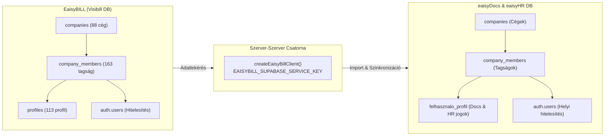

# DOC-04: Egységes Felhasználókezelés és EaisyBILL Adatforrás Integráció – Rendszerkutatás és Architektúra Terv

- **Készült:** 2026. október 11.
- **Modul:** eaisyDOCS & eaisyHR ➔ EaisyBILL Integráció
- **Kapcsolódó feladat:** DOC-04 (v1.2 Továbbfejlesztési terv)
- **Célközönség:** eaisyDocs és EaisyBILL fejlesztői csapat, termékfelelősök

---

## 1. Vezetői Összefoglaló & Üzleti Cél

Az ERP ökoszisztémában (EaisyBILL, EaisyWORK, EaisyDOCS, EaisyHR) a felhasználói törzset jelenleg mindegyik rendszerben manuálisan, egyenként kell felvenni. A **DOC-04** feladat célja:
1. Az **EaisyBILL**-ben már létező cégekhez rendelt felhasználói névsor **adatforrásként történő használata**.
2. **Szelektív import:** Az adminisztrátor átvehesse a munkatársakat anélkül, hogy minden külső szereplőt (pl. könyvelőt, ideiglenes számlázót) be kellene vonni az iratkezelőbe.
3. **Közös identitás, szeparált jogosultságok:** Az azonos személyazonosság (név, e-mail cím) megmaradjon, de az eaisyDocs (`docs_szerepkor`, irattári minősítés) és az eaisyHR (`hr_szerepkor`, munkaviszony) hozzáféréseket az iratkezelő adminisztrátora külön konfigurálhassa.
4. **Helyi felvétel megőrzése:** Azon munkatársak (pl. fizikai dolgozók, raktárosok), akik nem szerepelnek a számlázóban, továbbra is rögzíthetők legyenek közvetlenül helyben.

---

## 2. A Forrás- és Célrendszerek Feltárása (As-Is Állapot)

A `visibill-ea0dbcac` mappában található EaisyBILL forráskód és adatbázis elemzése alapján az alábbi tények rögzíthetők:



### 2.1 EaisyBILL (Forrásrendszer)
- **Példány:** `https://vxxgvdlqvvchtlmqnrqf.supabase.co`
- **Állomány:** 88 nyilvántartott gazdasági társaság, 113 felhasználói profil, 163 cég-felhasználó tagság.
- **Kapcsolati struktúra:**
  - `companies`: Cégazonosító (`id`), hivatalos név (`name`), adószám (`tax_number`), tulajdonos (`owner_id`).
  - `company_members`: Felhasználó-cég kapcsolótábla (`company_id`, `user_id`, `role: owner | admin | member | assistant | viewer | employee`).
  - `profiles`: Felhasználói törzsadatok (`user_id`, `name`, `position`, `company`, `avatar_url`, `eaisybill_access`, `eaisybooks_access`).
  - `auth.users`: Hitelesítési rekord (`id`, `email`, `user_metadata`).
- **Valós példa (Think Ai Kft):**
  - Cég ID: `ecf31039-b539-4e04-bbea-70ea48c701bb`
  - 11 hozzárendelt tag:
    - `balazs@thinkai.hu` (Balázs Lederer – owner)
    - `zoli@thinkai.hu` (Ágó Zoltán – admin)
    - `viktor@thinkai.hu` (Benke Viktor "Leonidas" – member)
    - `notbyalongway@gmail.com` (Schwarczinger János – admin)
    - `nagyd965@gmail.com` (Nagy Dániel – member)
    - Tesztfelhasználók: `test.employee@eaisybill.hu`, `test.member@...`, `test.assistant@...`, `sandbox@...`

### 2.2 eaisyDocs & eaisyHR (Célrendszer)
- **Példány:** `https://pdthccijqnhphjbtrtwo.supabase.co`
- **Kapcsolati struktúra:**
  - `companies`: Helyi bérlők (`id`, `name`, `tax_number`, `filing_prefix`, `logo_url`).
  - `company_members`: Céges tagság (`company_id`, `user_id`, `role`, `docs_szerepkor`, `hr_szerepkor`).
  - `felhasznalo_profil`: Kétszintű jogosultsági profil (`id` = `auth.users.id`, `nev`, `szerepkor`, `docs_szerepkor`, `hr_szerepkor`, `max_minosites`, `szervezeti_egyseg_id`, `hr_szervezeti_egyseg_id`, `elerheto_modulok`).
  - `auth.users`: Helyi jelszó- és munkamenet-kezelés.

---

## 3. Technikai Megvalósítási Stratégia

Mivel az EaisyBILL és az eaisyDocs **két különálló Supabase adatbázisban** él, a felhasználók átvételét a következő architektúra biztosítja:

### 3.1 Hitelesítés és Fiók-iniciálás (Auth Matching)

Az e-mail cím képezi az elsődleges egyedi azonosítót:

1. **Ha a felhasználó már létezik az eaisyDocs `auth.users` táblájában:**
   - *Példa:* `nagyd965@gmail.com`.
   - **Nem** jön létre új auth rekord.
   - A meglévő `felhasznalo_profil` megkapja az `eaisybill_user_id` és `sync_source = 'eaisybill'` jelölést.
   - Ha a felhasználó még nem tagja az aktív célvállalatnak, bekerül a helyi `company_members` táblába a kiválasztott szerepkörrel.
2. **Ha a felhasználó még nem létezik az eaisyDocs-ban:**
   - *Példa:* `balazs@thinkai.hu` vagy `zoli@thinkai.hu`.
   - Az eaisyDocs a Supabase Service Role Admin API-val hozza létre a fiókot:
     ```typescript
     const { data: newUser } = await supabaseAdmin.auth.admin.createUser({
       email: billUser.email,
       password: generateSecureTempPassword(),
       email_confirm: true,
       user_metadata: {
         name: billUser.name,
         source: 'eaisybill_import'
       }
     })
     ```
   - Létrejön a kapcsolódó `felhasznalo_profil` (`sync_source: 'eaisybill'`).
   - Bekerül az aktív cég `company_members` táblájába.
   - Opcionális: a felhasználónak kiküldhető egy meghívó / jelszóbeállító link (Brevo SMTP integráción keresztül).

---

### 3.2 Szerepkör és Jogosultság Megfeleltetés (Mapping)

Az eaisyBill és az eaisyDocs szerepkörei más üzleti logikát képviselnek, ezért az import során egy intelligens alapértelmezett megfeleltetést (mapping) alkalmazunk, amelyet az adminisztrátor az import varázslóban tetszőlegesen felülbírálhat:

| EaisyBILL Szerepkör | Javasolt eaisyDocs Szerepkör | Javasolt Minősítési Szint | Javasolt eaisyHR Szerepkör |
|---|---|---|---|
| `owner` | **Admin** (`admin`) | Szigorúan bizalmas | **Admin** (`admin`) |
| `admin` | **Admin** (`admin`) | Bizalmas | **HR Vezető** (`hr_vezeto`) |
| `member` | **Ügyintéző** (`ugyintezo`) | Belső | **Munkavállaló** (`munkavallalo`) |
| `assistant` | **Iktató** (`iktato`) | Belső | **HR Munkatárs** (`hr_munkatars`) |
| `viewer` | **Betekintő** (`betekinto`) | Nyílt | **Munkavállaló** (`munkavallalo`) |
| `employee` | **Ügyintéző** (`ugyintezo`) | Nyílt | **Munkavállaló** (`munkavallalo`) |

---

### 3.3 Cégpárosítási Mechanizmus (Multi-Tenant Mapping)

Az importálás során a rendszernek tudnia kell, hogy a forrás- és célcégek hogyan kapcsolódnak:
1. **Adószám egyezés (Automatikus):** Az aktív eaisyDocs cég adószámának első 8 számjegye (`tax_number.slice(0, 8)`) alapján keresünk az EaisyBILL `companies` táblájában.
2. **Név szerinti egyezés (Fallback):** Ha nincs adószám, a cég nevének normalizált összevetése (pl. `Think AI Kft.` ➔ `Think Ai Kft`).
3. **Kézi forráscég választó:** Ha az automatikus párosítás nem talál egyezést (vagy a felhasználó más cég munkatársait szeretné behúzni), a felületen egy kereshető legördülő listából kiválasztható bármelyik a 88 eaisyBill cég közül.

---

## 4. Javasolt Rendszermódosítások az eaisyDocs-ban

### 4.1 Adatbázis Migráció (`felhasznalo_profil`)
```sql
ALTER TABLE felhasznalo_profil 
ADD COLUMN IF NOT EXISTS eaisybill_user_id UUID,
ADD COLUMN IF NOT EXISTS sync_source TEXT DEFAULT 'local',
ADD COLUMN IF NOT EXISTS last_synced_at TIMESTAMPTZ;

CREATE INDEX IF NOT EXISTS idx_felhasznalo_profil_eaisybill_user_id 
ON felhasznalo_profil(eaisybill_user_id);
```

### 4.2 Szerver Akciók (`src/app/settings/eaisybill-user-actions.ts`)
- `getEaisyBillUsersForCompany(companyId?: string)`:
  - Lekéri a célcég eaisyBill tagjait a `visibill` adatbázisból.
  - Összefésüli a helyi `felhasznalo_profil` és `company_members` rekordokkal.
  - Visszaadja a tagok listáját az importálási státusszal:
    - 🟢 `Új importálható`: a felhasználó még nincs benne az eaisyDocs-ban.
    - 🟡 `Már létezik`: az e-mail már regisztrálva van, cégtagság vagy összekötés frissíthető.
    - ⚪ `Szinkronizálva`: már eaisyBill forrású aktív tag az eaisyDocs-ban.
- `importEaisyBillUsers(selectedUsers: ImportUserDto[], targetCompanyId: string)`:
  - Végrehajtja a kötegelt importálást, role mappingot és cégtagság-kiosztást.

### 4.3 Felhasználói Felület (UI / UX)
A Beállítások (`/settings`) **Csapat** lapján:
1. **Import Gomb:** *"Új felhasználó létrehozása"* mellett megjelenik a teal színű **"Importálás eaisyBill-ből"** gomb.
2. **Kanonikus Szinkronizációs Varázsló (`EaisyBillUserSyncDialog`):**
   - Fejlécben az összekapcsolt forráscég neve (cégváltó popoverrel).
   - Gyorskereső mező.
   - Táblázat kijelölő checkbox-szal: Név, E-mail cím, eaisyBill szerepkör, cél eaisyDocs szerepkör választó, minősítési szint, cél modulok (`Docs` / `HR`).
   - „Összes kijelölése” és „Kijelöltek importálása (X fő)” akciógombok.
3. **Forrásjelvények:** A csapattagok listájában minden felhasználó mellett diszkrét jelvény látható:
   - Zöld/teal `<Badge>eaisyBill</Badge>` az importált tagoknál.
   - Szürke `<Badge>Helyi</Badge>` a közvetlenül rögzített munkatársaknál.

---

## 5. Döntési és Egyeztetési Pontok az EaisyBILL Csapattal

Az alábbi kérdéseket javasolt átbeszélni a Visibill/EaisyBILL fejlesztőivel:

1. **Adatbázis-hozzáférés vs. Belső API:**
   - Megfelel-e a jelenleg használt direkt Supabase service-role alapú lekérdezés (`EAISYBILL_SUPABASE_SERVICE_KEY`), vagy van/lesz az EaisyBILL-nek dedikált belső REST API végpontja / webhook rendszere a felhasználói változásokhoz?
2. **Közös Hitelesítés (SSO) Ütemezése:**
   - Tervez-e az EaisyBILL központi auth/SSO szolgáltatást (pl. közös Supabase Auth instance vagy OAuth2 provider), vagy középtávon marad a modulonkénti szeparált Auth adatbázis?
3. **Törlések és Letiltások Kezelése:**
   - Ha egy felhasználót az EaisyBILL-ben inaktiválnak vagy törölnek (anonimizálnak a `delete-user` Edge Functionnel), az eaisyDocs-ban mi legyen a kívánt viselkedés?
     - *Javaslat:* Az iratkezelési és munkaügyi jogszabályok (335/2005. Korm. rend., Munka Törvénykönyve) miatt az eaisyDocs-ban a felhasználó sosem törlődhet fizikailag (mert korábbi iktatásokhoz, naplóbejegyzésekhez van rendelve). A javasolt lépés a helyi fiók inaktiválása (`hr_szerepkor = 'inaktiv'`, belépés tiltása).
4. **Jelszókezelés és Első Belépés:**
   - Hogyan jussanak el a hitelesítési adatok a felhasználóhoz, ha az EaisyBILL-ből vesszük át őket?
     - *Opció 1:* Automatikus Brevo e-mail egy aktiváló/jelszóbeállító linkkel az eaisyDocs-ba.
     - *Opció 2:* Ideiglenes jelszó generálása, amit az adminisztrátor ad át.
     - *Opció 3:* Jövőbeli Magic Link vagy közös SSO belépés.
